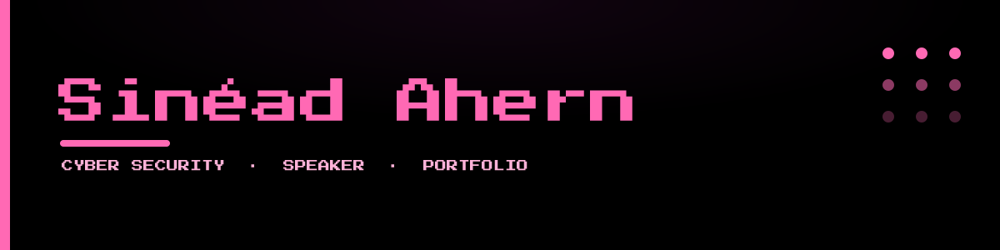

<picture>
  <source media="(prefers-color-scheme: dark)" srcset="./assets/banner-dark.svg">
  <source media="(prefers-color-scheme: light)" srcset="./assets/banner-light.svg">
  
</picture>

<p align="center">
  <a href="https://sineadahern.com"></a>
  
  
  
  
</p>

Personal portfolio site for **Sinéad Ahern** (Me >_<).

 **Live:** [sineadahern.com](https://sineadahern.com)

---


##  Stack

| Layer | Tech |
|-------|------|
| Framework | [Astro](https://astro.build) `^7` — static-first, zero-JS-by-default |
| Animation | [GSAP](https://gsap.com) `^3` |
| Language | TypeScript (`.astro` components + strict config) |
| Styling | Scoped CSS + CSS custom-property design tokens |
| Typography | [Press Start 2P](https://fonts.google.com/specimen/Press+Start+2P) (retro headings) · [Lato](https://fonts.google.com/specimen/Lato) (body) |
| Output | Fully static build (SSG) — deploys to any static host |


## Palette

Design tokens live in `src/styles/tokens.css`:

| Token | Hex |
|-------|-----|
| Brand pink | `#FF69B4` |
| Accent light | `#FFB3D9` |
| Accent dark | `#E0429A` |
| Light-mode pink | `#C22E7E` |
| Background (dark) | `#000000` |
| Background (light) | `#FFFFFF` |


## To use 

```bash
npm install      # install dependencies
npm run dev      # local dev server with hot reload
npm run build    # production build → ./dist
npm run preview  # preview the built site locally
```


## Structure

```
personal_site/
├─ assets/            # README banners (light + dark)
├─ public/            # images, thumbnails, 3D model, demos
├─ src/
│  ├─ components/     # NavWheel, SideNav, ThemeToggle, header/footer
│  ├─ layouts/        # BaseLayout.astro
│  ├─ pages/          # one .astro per route
│  └─ styles/         # global.css + tokens.css
├─ astro.config.mjs   # Astro config (+ /projects → /portfolio redirect)
├─ tsconfig.json
└─ package.json
```


## Pages

Home · About Me · Portfolio · Awards & Achievements · Cyber SOC · Public Speaking · Press

Ships with a light/dark theme and responsive layouts down to mobile.

---

<p align="center"><sub>Built with Astro · © Sinéad Ahern</sub></p>
